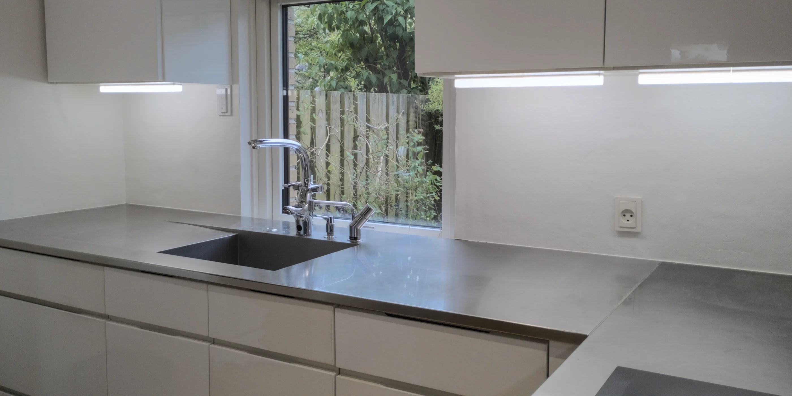
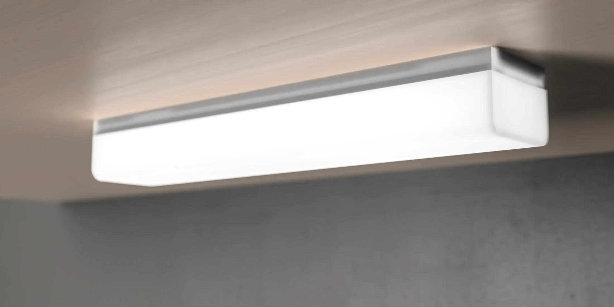

# The firefly downlight

Functional, minimalist and modern downlight meant to be hung on the bottom of a cabinet or similar. Designed with kitchen use in mind but can be used wherever you like. The design is free and open source, easily moddable and 3d printable, so the barrier to manufacturing your own (customized) units is low.

## Organization

The first place you will want to look is the [`docs`](./docs) folder. Here you'll find all the information needed to do whatever you like with the project.

In the [`CAD`](./CAD) folder you'll find all of the OpenSCAD source files for the models of the actual lamp, the source files for a few optional extra tools and the libraries used in the design.

The [`Final`](./Final) folder contains the output files of the final design. That means each model has an STL 3d object file, a 3mf PrusaSlicer project file and a sliced gcode file for use with the craftbot+ 3d printer (if you have a different printer you'll need to re-slice it yourself)

Finally [`Test prints`](./Test%20prints) can mostly be ignored, it just contains tests that I used during the design process. If you're unsure that your printer's settings are correct they might be useful to test that everything fits together before printing the final parts, each test print has a markdown file associated with it explaining exactly what it contains.

## Contributing

This product is licensed under [CC-BY-SA 4.0](./LICENSE.md) which means that you have the freedom to manufacture it, study the source material, redistribute the source material and to modify it and redistribute your modified version, even for commercial purposes. As long as you give appropriate credit and redistribute your modified version under the same copyleft terms.

If you decide to make some of these lamps for yourself it would be great if you left some feedback and explained your findings. To help me or someone else improve on the design. Feedback is important so that we can know what we're doing right, what we're doing wrong, and so that we can share ideas and inspirations that foster creativity and design improvements.

If you have generally useful modifications to this project, either the design itself or the documentation, you're very welcome to make a pull request and get your additions merged into this repo. Just make sure not to use any non-free file formats or your pull request will be rejected. Also feel free to go crazy and make improvements or modifications that might not be relevant to anyone but yourself, but if it doesnt line up with my vision of the project dont expect it to be merged into **this** repo.

Be creative and make the best of it. I found out that these lamps are actually also great for soldering, so I designed a [little part](./CAD/tools/helping_hands_mount.scad) that you can use to mount it to a pair of helping hands. I'm sure there are plenty of other uses that I cant think of, so it's your turn now to do that, maybe think a little outside the box and dont be afraid to experiment.

