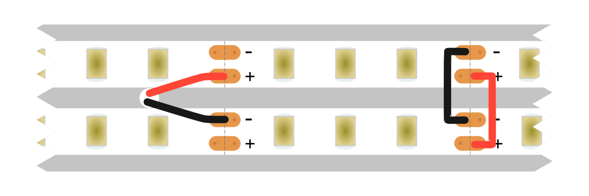

# What material to use

I used PLA and it worked well, but if you're worried about damage from the heat (which is a very valid concern) you should use a more heat resistant material like PETG or ASA. Obviously the diffuser needs to be printed in a white or translucent material because as much light as possible needs to pass through it, but it shouldnt be completely transparent because then it wouldnt have any effect at all. You could in theory print the other parts in a different color but I dont see why you would.

# Testing that the mount fits

The file [`Test prints/dovetail_mount_test_v1.6.tar.gz`](../Test%20prints/dovetail_mount_test_v1.6.tar.gz) contains some models a single mount that you can use to test fit the mounts on your parts individually

# Printing on top of the metal sheet

This is hard. Take a look at the [3mf file](../Final/lamp.3mf) for some inspiration. You need to get your bridging settings bang on. 

Make it print the first layer or 2 on top of the metal as solid layers and not honeycomb. The plastic coming out of the nozzle wont stick to the metal (gluestick helps but not much), only the plastic on either side of it, so it needs to touch that plastic as often as possible so that it has something to hang onto. 

I found that turning off thick bridges helped. By default it will probably want to bridge over the long side of the sheet, but playing around with the bridge flow ratio, in my case made it want to bridge over the short side of the sheet, which means that it sticks to the plastic much more often, your mileage may vary. I used a bridging speed of 45mm/s, that seemed to be not too fast but not too slow.

Another thing that helps a lot is starting with a freshly leveled bed, and when it gets to that first bridging layer, having your fingers on the bed levelling knobs and turning them while it's printing the first layer to get it to apply just the right amount of pressure. You want the plastic to come out onto the metal sheet, but you want it to be squezzed pretty hard or it wont stick. Because the sheet is never perfectly flat I needed to adjust it continously throughout the first layer. 

If you dont get a near perfect first layer it will come loose on the next layer and ruin the whole rest of the print.

# Drilling cable holes through the lamp

I used a metal sheet with holes already cut into it, so I could just use a hot needle to make the hole through the plastic. It might be smart to drill the hole in the metal sheet before inserting it into the lamp. But it shouldnt be too difficult to drill it after the fact. 

In the default configuration you have 2 LED strips on either side of the sheet with a 4mm gap between them. This leaves just enough room for a hole or 2 big enough to fit 2 dupont wires through.

# Attaching LED strips

I would suggest you drill the hole before attaching the LED strips to avoid damaging them. 

Because you're putting the LED strips directly on a conductive surface it's best to be safe and add a little strip of electrical or double sided tape between each conductive pad on the strip and the metal sheet. Also check with a multimeter that there's no connection.

The smartest way to orient the LED strips is so that one of them has the negative rail facing the middle of the lamp and the other has the positive rail facing the middle of the lamp. This makes soldering much easier.

# Soldering

I found that the best way to solder was to strip and pre-tin the wires (with flux), then attach the lamp to a solid surface and line up the wires with the pads on the LED strips. Then with a chisel tip on the iron I would heat up the pad and the wire and bring in an appropriate amount of solder, which melts quickly and flows right onto the pad, making a solid connection. Once it was soldered, then I'd route the cables through the hole out to the other side.

There's 14mm between the pads on the 2 LED strips. Prepare and pre bend the wires first, then solder like before, if you attached one end and the other doesnt quite line up there is a little wiggle room if you bend the middle of the cable.

## Connection diagram

You have to be quite precise because the height clearance is super tight. No criss crossing cables allowed or the diffuser wont fit. Here's a psuedo wiring diagram showing how I connected everything up:

# Attaching connectors

Obviously you have to attach the connectors after you've soldered, I used common 0.1" dupont or jumper connectors, but maybe experiment with other connectors yourself. They kinda suck to attach because you need a crimping press to do it, but in my opinion it's well worth it when the alternative is wago connectors or soldering. You dont technically need connectors though.

# Power wire clearance

Whether you're retrofitting them onto an old cabinet or running cables specifically for these you do need to be mindful of the clearance that the power wires need. Because the lamp slides on from the side you cant just make a little circular hole in the bottom of the cabinet for the wires to go through. Additionally you will also need to fit a connector in the hole in the cabinet. You need to do some mental gymnastics to figure out the clearance. 

Imagine that the lamp is hanging and is attached to the cabinet. You need a hole that's big enough for the connectors to fit inside. But then when you go to remove the lamp you also need to extend the hole at least 25mm to the side that the lamp slides off. So make sure that the connectors also fit 25mm to the left or right of the initial hole.

Of course you also have to make sure that the wires never intersect with the individual mounts on the lamp mount, and the lamp mount needs to have a cutout that the wires can also always fit through.

# Grouping 2 together

The design is made for 2 lamps to sit right next to each other. The side that you slide the diffuser in from is a bit uglier that the other side, so that side needs to face the other lamp. When 2 lamps are grouped together like this they hide the ugly side and the left lamp slides off to the left and the right one slides off to the right, so both of them are actually possible to remove without interfering with the other one.

# Finishing

Sanding it completely smooth by hand looks very nice but also takes 10+ hours per lamp. So it's not exactly practical to do. I only sanded the rounded corners on mine and they look fine. But if you have a belt grinder you might be able to do it in a practical amount of time. Maybe try out sand blasting. Painting is probably not a good idea since the light has to shine through the plastic and the paint would probably just block it. If you have a good resin printer you might not even have to do any finishing. It depends on how picky you are with the finish, what you end up doing here. Making it with traditional plastic manufacturing methods instead of 3d printing is also a good option, although quite expensive.

# Simple/suggested mods

## Dimming

If you're concerned about overheating, or you just want to extend the life span of you LED strips I recommend that you run them at a slightly lower voltage than what they're rated for. Thermal management is one of the few untested concerns I have with these lamps, I dont have any hard data to back me up but I think the thermals are fine, I'm not 100% sure though. Especially if you've made them out of PLA dimming them a bit is probably a good idea, if nothing else least they'll last longer.

The lamps are very bright, so even at 70% brightness they're probably good enough for your needs. I personally hate PWM dimmers, and I would always suggest that you dim the proper way, which is to adjust the actual voltage that's applied to the LEDs.

## Bi color LEDs

Since there are 2 LED strips per lamp it would be an obvious mod to have 2 different color temperatures per lamp. This way you can add CCT control it does require a few extra wires, but if you drill 2 holes right next to each other that shouldnt be a problem. 

Changing the width in `dimensions.scad` is also quite easy, so if you wanted RGBCCT you could, or any other combination of 2, 3, 4 or more LED strips in each lamp.

## Screw mounting

Do you also not trust adhesive, magic tape is stupidly strong, I tested that a single mount can hold multiple kilograms, for reference one lamp weighs less than 100g and has 2 mounts holding it on, but maybe you still dont like the idea of mounting the lamps with tape. In that case it should be easy to mod the lamp mount so that it can be screwed on instead of taped. If you do you should set the `Dmount/male/tape_thickness` variable in `dimensions.scad` to `0`.
